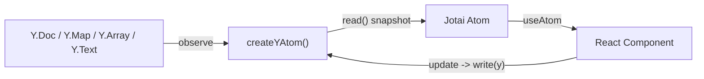

# Y-Jotai Bridge

> A minimal, type-safe bridge between Yjs (CRDT) and Jotai (React state).
>
> It provides reactive bindings without redundant renders, and makes Yjs feel like native React state — thin, predictable, and safe.

## ✨ 设计理念

| 目标                 | 描述                                                        |
| ------------------ | --------------------------------------------------------- |
| **薄（Thin）**        | 不重新实现任何 Yjs 或 Jotai 功能，只是做一层「读 / 写 / 订阅」的桥。               |
| **安全（Safe）**       | 写入通过 Yjs 原生事务 (`doc.transact`)，只触发一次事件回流，不手动 `set`。       |
| **精准（Narrow）**     | 默认 `observe()` 而非 `observeDeep()`，可通过 `eventFilter` 精准订阅。 |
| **高效（Efficient）**  | `equals` 避免重复更新，`eventFilter` 局部订阅，`deep` 控制级联。           |
| **类型安全（Typed）**    | 泛型接口清晰：`YType`, `T`, `Evt`；不会滥用 `any`。                    |
| **工程完备（Complete）** | 内置 Map / Array / Text / Path 四种工厂函数，覆盖大多数 Yjs 场景。         |

## 🧠 核心思想

这套桥的设计理念是：

> “**Jotai 只看快照，不持久状态。Yjs 才是真相。**”

也就是说，React 层只关心 *投影值*（snapshot），而不会直接操作 CRDT。一切写入通过 Yjs 原生 API 实现，以保持正确的同步与协同。



## ⚙️ 3. 核心 API

### `createYAtom()`

```ts
function createYAtom<YType extends Y.AbstractType<any>, T, Evt extends Y.YEvent<YType>>(
  opts: {
    y: YType
    read: (y: YType) => T
    write?: (y: YType, next: T) => void
    equals?: (a: T, b: T) => boolean
    deep?: boolean
    eventFilter?: (evt: Evt) => boolean
  }
): WritableAtom<T, [T | ((prev: T) => T)], void>
```

#### ✅ 特点

* **订阅行为可控**：默认浅监听 (`observe`)，如需递归可设 `deep: true`。
* **精准事件过滤**：通过 `eventFilter` 仅响应相关变更。
* **重复值过滤**：通过 `equals`（默认 `Object.is`）跳过相等更新。
* **安全写入**：内部自动封装 `doc.transact()`。
* **无双写**：写后不手动 `set()`，等待 Yjs 回流事件。

#### ⚠️ 注意事项

* `read(y)` **必须轻量**：请只读必要数据，不要整棵 `toJSON()`。
* `equals` 应匹配你的数据结构（默认浅比较）。
* 写入逻辑需使用 **原生 Yjs API**，不要替换整个对象。

---

## 🧩 4. Specialized Factories

| 函数                                      | 适用场景              | 示例                                                                        |
| --------------------------------------- | ----------------- | ------------------------------------------------------------------------- |
| **`createYMapKeyAtom(map, key)`**       | 针对单个 `Y.Map` key  | `const titleAtom = createYMapKeyAtom(meta, 'title')`                      |
| **`createYArrayIndexAtom(arr, index)`** | 针对单个 `Y.Array` 元素 | `const itemAtom = createYArrayIndexAtom(items, 0)`                        |
| **`createYTextAtom(text)`**             | 绑定整个 `Y.Text` 文本  | `const textAtom = createYTextAtom(ytext)`                                 |
| **`createYPathAtom(root, path)`**       | 多层嵌套访问            | `const atom = createYPathAtom(doc, ['cellMap', id, 'metadata', 'title'])` |

这些函数都是 `createYAtom` 的轻量包装，提供类型安全、精准事件过滤。

---

## 💻 5. 使用示例

### 5.1 Map Key

```tsx
// atoms.ts
export const titleAtom = createYMapKeyAtom<string>(
  doc.getMap('meta'),
  'title'
)

// component.tsx
function TitleInput() {
  const [title, setTitle] = useAtom(titleAtom)
  return <input value={title} onChange={(e) => setTitle(e.target.value)} />
}
```

### 5.2 Array Index

```tsx
const list = doc.getArray<string>('todos')
const firstTodoAtom = createYArrayIndexAtom(list, 0)

function TodoItem() {
  const [text, setText] = useAtom(firstTodoAtom)
  return <input value={text} onChange={(e) => setText(e.target.value)} />
}
```

### 5.3 Text

```tsx
const bodyAtom = createYTextAtom(doc.getText('body'))

function Editor() {
  const [text, setText] = useAtom(bodyAtom)
  return <textarea value={text} onChange={(e) => setText(e.target.value)} />
}
```

### 5.4 Deep Path

```tsx
const titleAtom = createYPathAtom<string>(
  doc,
  ['cellMap', '01H2Z...', 'meta', 'title']
)
```

## 🧱 6. 性能保障机制

| 层        | 机制                         | 说明                    |
| -------- | -------------------------- | --------------------- |
| **Y 层**  | `eventFilter`              | 只触发真正相关的 key/index 更新 |
| **桥层**   | `equals`                   | 同值不 set()，不触发 React   |
| **事务层**  | `doc.transact()`           | 合并批量写入为单次事件           |
| **订阅层**  | `observe` vs `observeDeep` | 默认浅监听，避免全树更新          |
| **写入策略** | 不手动 set()                  | 避免双写 & 重复事件回流         |

> 💡 性能瓶颈唯一可能来源是 `read()` 若执行全量序列化（如 `toJSON()`）。
> 请使用局部读取或 selector 模式。

## 🧩 7. 调试与 Review 指南

### ✅ Review Checklist

| 项目       | 检查项                         | 理由            |
| -------- | --------------------------- | ------------- |
| **事务安全** | 是否所有写入都包裹在 `withTransact()` | 防止多次触发        |
| **事件订阅** | 是否在 onMount 返回 unsubscribe  | 防止内存泄漏        |
| **读函数**  | 是否轻量级（非全量 toJSON）           | 性能关键          |
| **过滤逻辑** | 是否正确使用 `eventFilter`        | 避免无关重渲        |
| **比较逻辑** | `equals` 是否匹配预期类型           | 避免假阴性 / 假阳性   |
| **写入路径** | 是否使用 Yjs 原生 API（而非直接替换对象）   | 保证 CRDT 合并正确性 |

### 🧩 调试建议

在开发模式下可以开启：

```ts
if (process.env.NODE_ENV === 'development') {
  console.debug('[y-jotai] subscribed to', y)
}
```

或者在 `read(y)` 内打印调用频率，用以检查是否有不必要的频繁更新。

## ⚡ 8. 使用建议

### ✅ 推荐用法

* 为每个逻辑单元（cell / block / field）建立独立的 atom。
* `equals` 用浅比较即可；大对象可引入 `fast-deep-equal`。
* 对 `Y.Text` 这类高频输入，考虑节流（throttle）或 diff 算法。

### ⚠️ 避免用法

* ❌ 不要在 `read()` 里直接 `.toJSON()` 大型结构。
* ❌ 不要手动在写入后 `set()`。
* ❌ 不要滥用 `deep: true`，除非确实需要。

## 🧩 9. 扩展方向（TODO）

* [ ] `createYAtomFamily` → 支持 `(id) => atom`
* [ ] Undo/Redo helpers (`useYUndo()`, `useYRedo()`)
* [ ] Presence awareness hooks
* [ ] `useYSelector`（类 Recoil selector，支持局部依赖）

## ✅ 12. Quick Summary for Reviewers

| 点        | 说明                                |
| -------- | --------------------------------- |
| **作用**   | Yjs 与 Jotai 的高效桥接                 |
| **状态流向** | Yjs → createYAtom → Jotai → React |
| **同步语义** | 单向快照 + 回流事件                       |
| **防抖机制** | eventFilter + equals + transact   |
| **可靠性**  | 无手动 set、无双触发、自动解绑                 |
| **风险点**  | read() 过重、deep 监听滥用               |
| **总体评价** | ✅ 架构合理 ✅ 性能可靠 ✅ 类型完备 ✅ 可生产使用      |